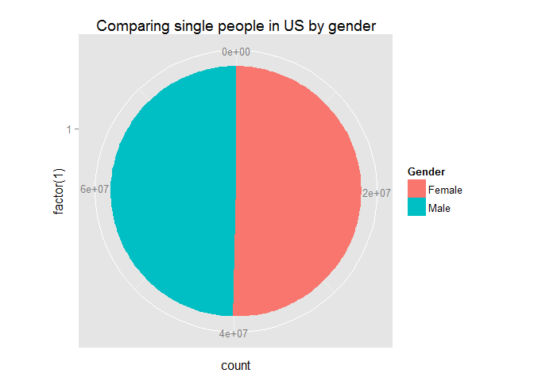
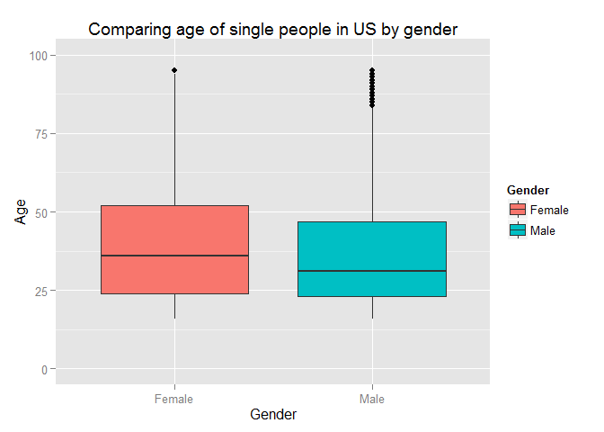
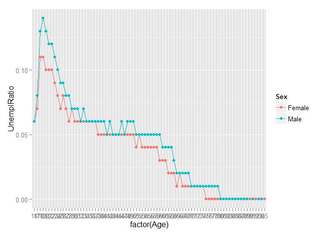
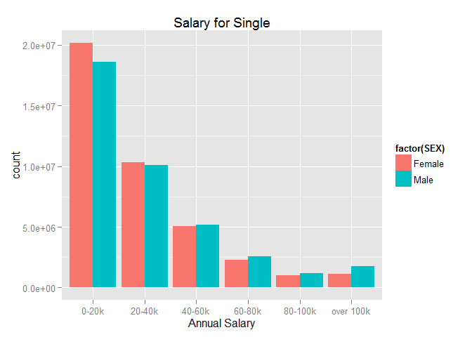

1 Introduction
==============

<p>
In this script we are interested to see that as a graduate master student, assume I am free to choose the place to work, where is the best state to meet my life partner? (we look for a suitable husband/wife not from mentally match but focus on more reality consideration)

Our ultimate goal is end up with a serach engine that can show you the best state based on your preference of life partner.

So let's start our story here, I am a young lady that will finish my master program on Dec, where should I work?
</p>
### 1.1 Libraries we need

``` r
library(rCharts)
library(htmltab)
library(rMaps)
library(rCharts)
library(ggplot2)
library(dplyr)
```
### 1.2 Load data

``` r
load("data/pop4.RData")
actualPopulation<-
  htmltab("https://en.wikipedia.org/wiki/List_of_U.S._states_and_territories_by_population",1)

actualPopulation<-actualPopulation[1:52,3:4]
names(actualPopulation)<-c('StateName','ActualPop')
actualPopulation$StateName<-substring(actualPopulation$StateName,3)
actualPopulation$StateName[48]<-substring(actualPopulation$StateName[48],3)
actualPopulation$ActualPop<-as.numeric(gsub(',','',actualPopulation$ActualPop))
```

### 1.3 How many are they?

First of all I want to know and to compare the number of single women and men all over the state (including divorced, widowed and separated people)

The first thing that come into my mind is I need to understand about some information about both single ladies (understand your competitors) and single men.

``` r
#excluding married people, and missing values
sindata<-tbl_df(pop4)
sindata<-sindata %>%
  na.omit() %>%
  filter(MSP %in% c('Widowed','Divorced','Separated','Never married')) %>% #code 1&2 are married
  group_by(SEX)
```

 

<p>
We can see that single female is slightly more than males but half of single female are aobve 45 yeas old.
</p>
<p>
then we do a quick math:
</p>
``` r
#Compute the percentage of weighted single people over total population
sum(sindata$PWGTP)/sum(pop4$PWGTP)
```

    ## [1] 0.2515322

Great! about 25% of population are single even though single ladies are slightly more than single men, I still have a great chance to find a nice husband.

<b><i>The next question is, how a nice husband is defined?</i>.</b>

### 1.4 How about the employment status, income and education level for them?

<p>
To my point of view, I do not want to marry a man with a very low income. He should at least have a job and a college degree.

For the next part, I want to know about these information for the single population.
</p>
<b>1.4.1 Employment status</b>

``` r
unempl<-empl[empl$ESR==3,]
unempl2<-aggregate(unempl$PWGTP,by=list(unempl$AGEP,unempl$SEX),FUN=sum)
names(unempl2)<-c('Age','Sex','UnemplCount')
unempl2$id<-paste0(unempl2$Age,unempl2$Sex)
```



<p>
NEED TO REPHRASE THE FOLLOWING!!!!!! The good news 70% single women are unemployed, so in that sense, I am in top 30% uh? but the bad news is about 75% single men do not have a job when the survey was conducted, unbelievable!
</p>
<b>1.4.2 Income level</b>

<p>
I break their income into 6 levels and calculate the weighted count
</p>
``` r
#break the WAGP (lower=0, upper=100000, by=20000)
popudata$WAGP2[popudata$WAGP %in% c(0:20000)] <- "0-20k"
popudata$WAGP2[popudata$WAGP %in% c(20000:40000)] <- "20-40k"
popudata$WAGP2[popudata$WAGP %in% c(40000:60000)] <- "40-60k"
popudata$WAGP2[popudata$WAGP %in% c(60000:80000)] <- "60-80k"
popudata$WAGP2[popudata$WAGP %in% c(80000:100000)] <- "80-100k"
popudata$WAGP2[popudata$WAGP %in% c(100000:1000000)] <- "over 100k"

#sum the weights
popudata<-aggregate(popudata$PWGTP,by=list(popudata$WAGP2,popudata$SEX),FUN=sum)
names(popudata)<-c('WAGP','SEX','PWGTP')
```



<p>
From the above plot, the low paid group(under 20k annual), for both female and male, dominate all other groups.
</p>
<b>1.4.3 Education level</b>

Change the SCHL codes into different college degrees
```{r}
per_edu$SCHL2<-as.character(per_edu$SCHL)
per_edu$SCHL2[per_edu$SCHL%in%c('Less than 3 years old','No schooling completed',
                                'Nursery school, preschool, Kindergarten',
                                'Grade 1-12 and no diploma','Regular high school diploma',
                                'GED or alternative credential','Some college, no degree')] <- "No degree"
per_edu$SCHL2<-factor(per_edu$SCHL2)
```


<p>
After reading the plots above, I become really nervous about looking for my ideal husband. If I randomly pick a man from US single gentlemen then most of time he is not going to be a perfect husband for me.
</p>
<p>
Please note that, even you are a young gentlement who is looking for a nice wife, your situation is not optimistic.
</p>
2 In which states can I find him/her?
=====================================

<p>
As we have seen, finding a good parnter is an intense competition actually, if I want to stand out, I must have some tricks. Here is the trick: I am going to locate one state which has the largest number of my "good" husbands. Also I decide to lower my boyfriend criterion:
</p>
<i>"I want him to have an annual income over 100K, I do not care his age, educaiton or whether he has married before. Basically I just want a sugar daddy." Women is fickle and you know it</i>

<b>2.1 Some library change for this part</b>

``` r
detach(package:dplyr,unload=T)
library(plyr)# these two packages are clashed in some functions
```

<b>2.2 Generating plots</b>

``` r
state<-aggregate(pop3$PWGTP, by=list(pop3$abbr,pop3$name), FUN=sum)
names(state)<-c('State','StateName','TotalCountWithWeight')

# Plotting sugar daddy
sugarDaddy<-pop3[pop3$single=='Single'&pop3$SEX==1&!is.na(pop3$WAGP)&pop3$WAGP>=100000,]
sugarDaddy2<-aggregate(sugarDaddy$PWGTP,by=list(sugarDaddy$abbr), FUN=sum)
names(sugarDaddy2)<-c('State','CountWithWeight')
sugarDaddy3<-merge(sugarDaddy2,state,by='State',all.x=T)
sugarDaddy3$Perc<-round(sugarDaddy3$Count/sugarDaddy3$TotalCount*100,1)
sugarDaddy4<-merge(sugarDaddy3,actualPopulation,by='StateName',all.x=T)
sugarDaddy4$ExpectedCount2015<-round(sugarDaddy4$Perc*sugarDaddy4$ActualPop/100,0)

ichoropleth(Perc ~ State,legend=T,pal='YlOrRd',data=sugarDaddy4)
```

### Expected percentage of single males earning more than 100K annually

<p align="center">

</p>
``` r
ichoropleth(ExpectedCount2015 ~ State,legend=T,pal='YlOrRd',data=sugarDaddy4)
```

### Expected total number of single males earning more than 100K annually

<p align="center">

</p>
<p>
It seems like New York, California and Massachuset are the best states for me to find my sugar daddy. Great!
</p>
<p>
I am also curious about Where a young man should go to look for his girl? If his girlfriend criterion are:
</p>
<i>"she will be younger than 30 years old with at least a university degree and she must have a job"</i>

<p>
Then I have the following plots:
</p>
``` r
pgirl<-pop3[pop3$single=='Single'&pop3$SEX==2&pop3$AGEP<30&!is.na(pop3$SCHL)&pop3$SCHL>=21&!is.na(pop3$ESR)&pop3$ESR%in%c(1,2,4,5),]
pgirl2<-aggregate(pgirl$PWGTP,by=list(pgirl$abbr), FUN=sum)
names(pgirl2)<-c('State','CountWithWeight')
pgirl3<-merge(pgirl2,state,by='State',all.x=T)
pgirl3$Perc<-round(pgirl3$Count/pgirl3$TotalCount*100,1)
pgirl4<-merge(pgirl3,actualPopulation,by='StateName',all.x=T)
pgirl4$ExpectedCount2015<-round(pgirl4$Perc*pgirl4$ActualPop/100,0)

ichoropleth(Perc ~ State,data=pgirl4,pal = 'PuRd')
```

### Expected percentage of single females younger between 16-29 years old, graduated from college, and have a job

<p align="center">

</p>
``` r
ichoropleth(ExpectedCount2015 ~ State,data=pgirl4,pal = 'PuRd')
```

### Expected total number of single females younger between 16-29 years old, graduated from college, and have a job

<p align="center">

</p>
<p>
New York, California and Massachuset are also great choice for him and he has more options such as Pennsylvania, Illinois and Nevada
</p>
3 Which indusrties are the best?
================================

<p>
I decide to live in either New York state or California to meet my sugar daddy then I need to know where can I meet him. The best idea will be we work together. So the next step I will figure out where they works. Luckily, data scientist can work in various field.
</p>
    ##    State             Industry CountWithWeight Perc
    ## 26    NY Professional Service          247305 1.26
    ## 30    NY               Retail          218306 1.11
    ## 25    NY        Entertainment          212229 1.08
    ## 27    NY              Finance          193745 0.99
    ## 22    NY         Construction          171875 0.87
    ## 31    NY        Manufacturing          145781 0.74

    ##    State             Industry CountWithWeight Perc
    ## 15    CA               Retail          478291 1.25
    ## 12    CA Professional Service          464896 1.21
    ## 11    CA        Entertainment          396080 1.03
    ## 4     CA        Manufacturing          346435 0.90
    ## 7     CA         Construction          313626 0.82
    ## 13    CA              Finance          217730 0.57

4 Conclusions
=============

<p>
As a master student, if you are single then you should be aware that to find a life parnter who has similiar qualification and income level as you is really hard after you leave school. So try to find one at school!

If you are a rich gentleman who do not care your wife's income then obviously you have more choice. You do not need to rush. Girls will do their best to find you!

To find my dream life partner, I am going to find a data scientist job in New York or California among retail, professional services and manufactoring industry.
</p>
5 Next Step
===========

<p>
I would like to build a search engine that automate the proecss of filtering and ploting and it will show the best states to find your life parnter based on your preference
</p>
<p>
Below is a demo, hope you like it!
</p>
<a href="https://yueshengu.shinyapps.io/findingLifePartner/" target="_blank" style="font-size:40px">Soulmate Exploration Engine</a> \`\`\`
